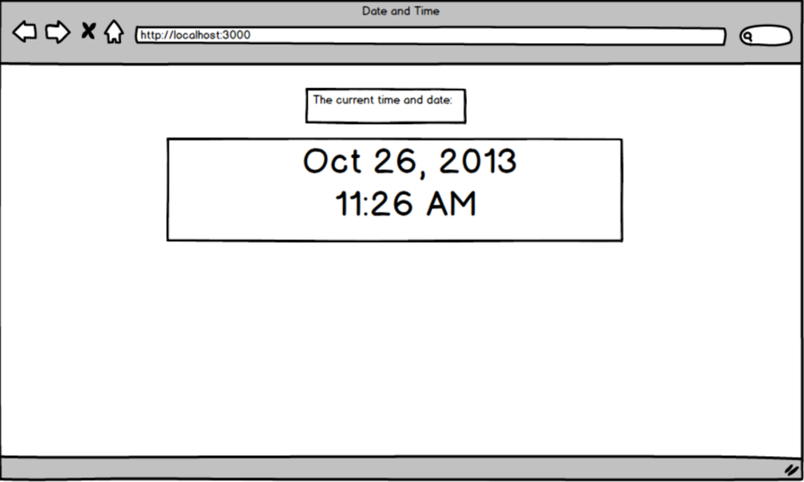

Time Display
Create an ASP.NET Core app that finds the current date and time, formats it, and displays it on the front-end.

You can access the current time with C#'s DateTime class.

DateTime CurrentTime = DateTime.Now;
Copy
In Terms of formatting the Date and Time there are ample resources avaliable and that is also part of this challenge is discovering those resources for yourself. This may be a proper time to practice that google-fu :)

 

